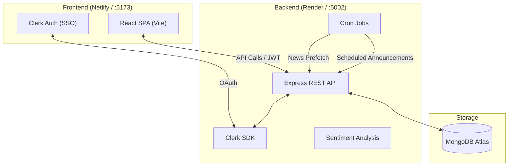

# Nirmitee Internal Communications Hub

[](#)
[](#)

A full-stack internal communications platform for **Nirmitee Infotech**, bringing together company news, blogs, discussions, surveys, learning, employee recognition, and more — all in one place.

## ✨ Key Features

| Module | Description |
|--------|-------------|
| **News Feed** | Aggregated tech news via **NewsData.io** / RSS with category filtering |
| **Blogs** | Rich-text blog authoring with comments, bookmarks, and analytics |
| **Discussions** | Threaded discussion forums with voting and analytics |
| **Announcements** | Company-wide announcements with scheduled publishing |
| **Groups** | Interest-based groups with posts, comments, and analytics |
| **Surveys & Polls** | Create, distribute, and analyze employee surveys and quick polls |
| **Learning (LMS)** | Courses, modules, progress tracking, certificates, mentorship |
| **Recognition & Rewards** | Peer recognition, points, leaderboard, rewards catalog, redemptions |
| **Employee Directory** | Search and browse company employees with profiles |
| **Search** | Global search across blogs, discussions, and users |
| **Activity Feed** | Real-time timeline of company-wide activities |
| **Moderation** | Admin tools for content moderation (blogs, announcements) |
| **Theme Customization** | Organization-level theme and branding configuration |

## 🛠️ Tech Stack

| Layer | Technologies |
|-------|-------------|
| **Frontend** | React 18, Vite, TailwindCSS, Zustand, React Query, Clerk Auth, Framer Motion, Recharts, TipTap, Lucide Icons |
| **Backend** | Node.js, Express.js, MongoDB (Mongoose), Clerk SDK, RSS Parser, Sentiment Analysis, Nodemailer, **node-cron** |
| **Auth** | Clerk (Google SSO + email), JWT, RBAC (admin / moderator / user) |
| **Deployment** | Render (backend), Netlify (frontend), Docker, GitHub Actions (keep-alive) |

## 🏗️ Architecture



## 📁 Project Structure

```
Nirmitee Internal Project/
├── backend/                    # Express.js API server
│   ├── config/                 # DB connection, data initialization
│   ├── constants/              # Role definitions
│   ├── controllers/            # 21 route handlers
│   ├── jobs/                   # Cron jobs (news, announcements)
│   ├── middleware/             # Auth, RBAC, rate limiter, error handler
│   ├── models/                 # 27 Mongoose models
│   ├── routes/                 # 16 API route groups
│   ├── scripts/                # Utility & seed scripts
│   ├── services/               # 16 business-logic services
│   ├── utils/                  # Helpers, logger, newsData/sentiment helpers
│   └── server.js               # Entry point
│
├── frontend/                   # React + Vite SPA
│   ├── public/                 # Static assets & favicons
│   ├── src/
│   │   ├── components/         # 50+ reusable components
│   │   ├── config/             # Centralized route config
│   │   ├── store/              # Zustand stores (auth, creation)
│   │   ├── pages/              # 56 page components (18+ modules)
│   │   ├── services/           # 12 API service modules
│   │   └── App.jsx             # Root component
│   ├── vite.config.js
│   └── package.json
│
├── .github/workflows/          # GitHub Actions (Render keep-alive)
├── docker-compose.yml          # Multi-container Docker setup
└── README.md                   # ← You are here
```

## 🚀 Quick Start

### Prerequisites

- **Node.js** 18+
- **npm** 9+
- **MongoDB** Atlas account (or local instance)
- **Clerk** account ([clerk.com](https://clerk.com)) for SSO

### 1. Clone the Repository

```bash
cd "Nirmitee Internal Project"
```

### 2. Backend Setup

```bash
cd backend
npm install
cp .env.example .env   # Fill in values from backend README
npm run dev             # http://localhost:5002
```

### 3. Frontend Setup

```bash
cd frontend
npm install --legacy-peer-deps
cp .env.example .env   # Fill in values from frontend README
npm run dev             # http://localhost:5173
```

### 4. Open in Browser

Navigate to **http://localhost:5173** — the Vite proxy forwards `/api` requests to the backend.

## 🐳 Docker Setup

```bash
docker-compose up --build
```

| Service | Port |
|---------|------|
| Backend | `http://localhost:5002` |
| Frontend | `http://localhost:3000` |

## 🚢 Deployment

| Service | Platform | URL |
|---------|----------|-----|
| Backend | Render | [API Link](https://nirmitee-internal-communications-hub.onrender.com) |
| Frontend | Netlify | [App Link](https://nirmitee-internal-hubb.netlify.app) |

### GitHub Actions

A **keep-alive** workflow (`.github/workflows/keep-alive.yml`) pings the Render backend health endpoint every 14 minutes to prevent the free-tier service from sleeping.

## 📚 Detailed Documentation

- **[Backend README](./backend/README.md)** — API reference, models, middleware, environment variables
- **[Frontend README](./frontend/README.md)** — Pages, components, hooks, state management

---

Built with ❤️ by the **Nirmitee Infotech** team.
Proprietary — Internal use only.
